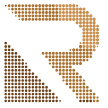
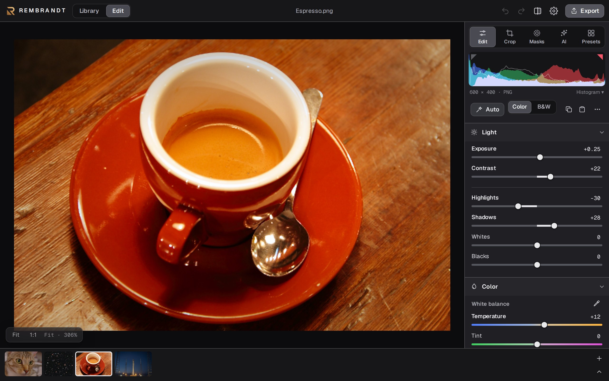
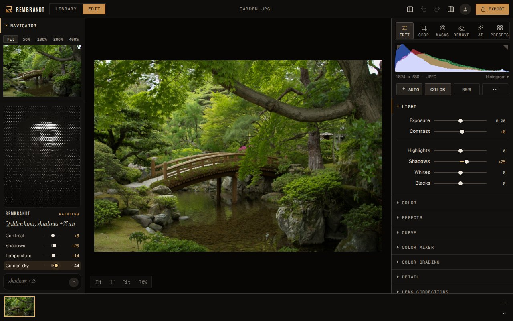
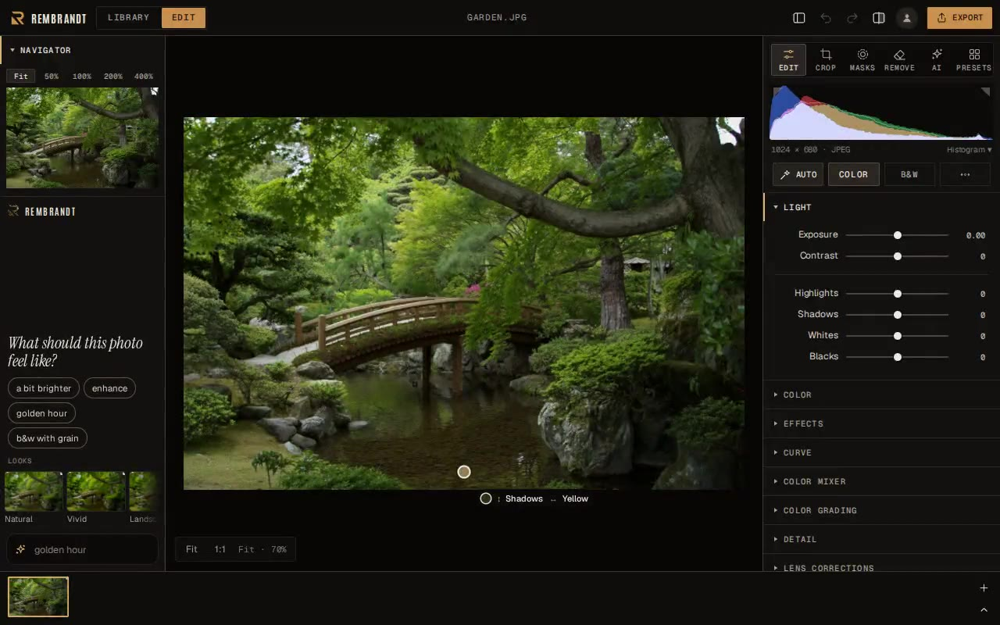
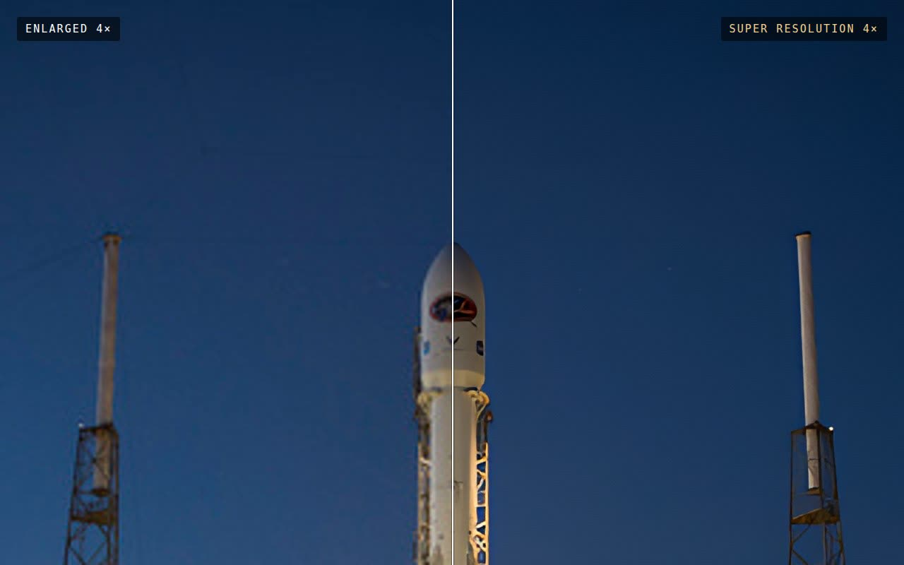
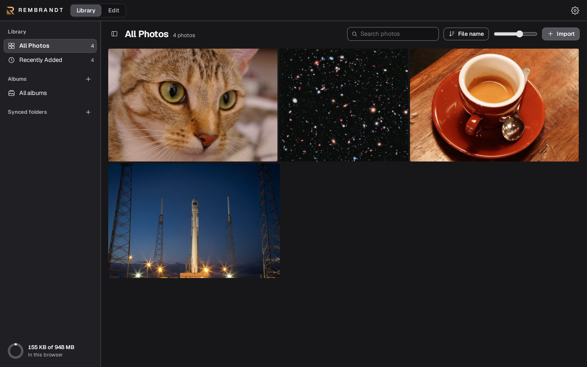
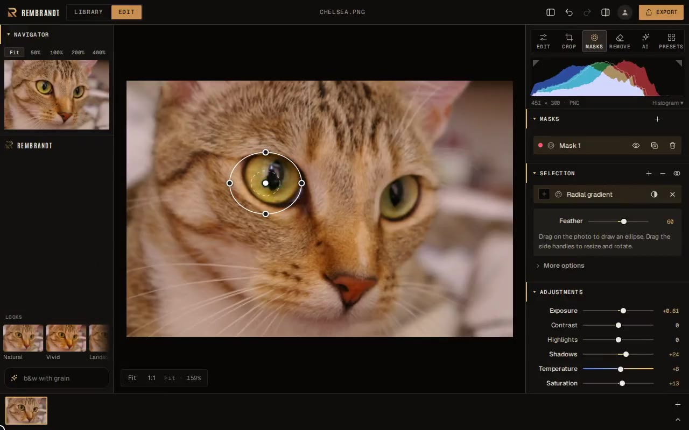
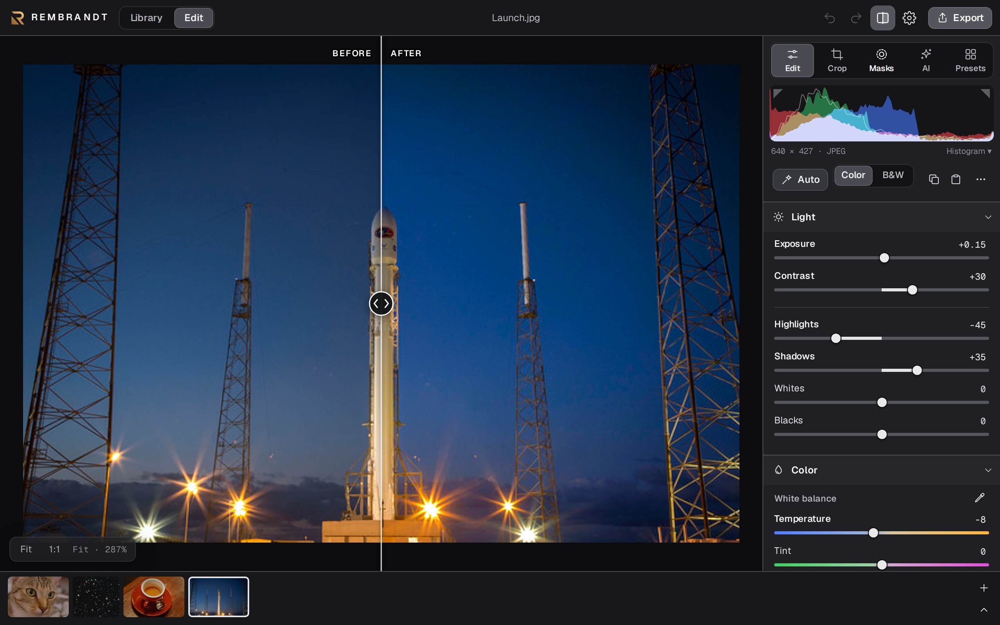

<p align="center"><picture><source media="(prefers-color-scheme: dark)" srcset="brand/r-mark-halftone.svg"></picture></p>
<h1 align="center">Rembrandt</h1>
<p align="center"><b>Stop paying for Adobe. Flush the incrapification.</b></p>
<p align="center">A free photo editor for macOS, Windows and Linux.<br>
No account needed, no subscription, no “we’ve updated our terms” emails.</p>
<p align="center">
  <a href="#download"><b>Download</b></a> ·
  <a href="#self-host-it">Self-host</a> ·
  <a href="#features">Features</a> ·
  <a href="#build">Build</a>
</p>

<p align="center"></p>

<table>
  <tr>
    <td width="33%"></td>
    <td width="33%"></td>
    <td width="33%"></td>
  </tr>
  <tr>
    <td align="center"><sub><b>Ask</b>: “golden hour, shadows +25”, and watch Rembrandt paint it</sub></td>
    <td align="center"><sub><b>Touch</b>: drag on the photo to change that tone or colour</sub></td>
    <td align="center"><sub><b>Super Resolution</b>: 2× and 4× on your GPU</sub></td>
  </tr>
  <tr>
    <td width="33%"></td>
    <td width="33%"></td>
    <td width="33%"></td>
  </tr>
  <tr>
    <td align="center"><sub><b>Library</b>: albums, search, sorting, one-click delete</sub></td>
    <td align="center"><sub><b>Masks</b>: brush, gradients, AI subject and depth</sub></td>
    <td align="center"><sub><b>Before / after</b>: split or side by side</sub></td>
  </tr>
</table>

## Download

| Platform | |
|---|---|
| macOS · Apple silicon | [Rembrandt-macos-arm64.dmg](https://github.com/thesnarkitecht/rembrandt/releases/latest/download/Rembrandt-macos-arm64.dmg) |
| macOS · Intel | [Rembrandt-macos-x64.dmg](https://github.com/thesnarkitecht/rembrandt/releases/latest/download/Rembrandt-macos-x64.dmg) |
| Windows · x64 | [Rembrandt-windows-x64-setup.exe](https://github.com/thesnarkitecht/rembrandt/releases/latest/download/Rembrandt-windows-x64-setup.exe) |
| Windows · ARM | [Rembrandt-windows-arm64-setup.exe](https://github.com/thesnarkitecht/rembrandt/releases/latest/download/Rembrandt-windows-arm64-setup.exe) |
| Linux · x86_64 / arm64 | `curl -fsSL https://raw.githubusercontent.com/thesnarkitecht/rembrandt/main/install.sh \| bash` |

All files and checksums: [Releases](https://github.com/thesnarkitecht/rembrandt/releases).
Builds aren't code-signed yet: on macOS use System Settings → Privacy & Security → **Open Anyway**;
on Windows **More info → Run anyway**.

## Self-host it

Serve Rembrandt from the computer that holds your photos and edit them in any browser:

```sh
curl -fsSL https://raw.githubusercontent.com/thesnarkitecht/rembrandt/main/install.sh | bash -s -- --server
```

It asks which photo folder to use, starts at login, and prints a private link. Edits are saved next
to each photo as XMP; the photos themselves are never changed. Add `--lan` to reach it from other
devices on your network. Linux and macOS; one small dependency-free binary (`server/`).
To update, press **Update** in the browser (Settings › About); it installs the latest release,
checks it against the published SHA-256 sums, and restarts the server.

## Features

- **Ask in words**: type “warmer and a bit brighter”, “down exposure by ten points”, “shadows +25”
  or “paste the edits from the previous photo” (Ctrl/⌘ K). A small Rembrandt in dots thinks it over,
  then makes each change while you watch the sliders move. It runs on your device: a vocabulary, not
  a language model.
- **Edit the photo itself**: drag up or down on any part of the picture to lighten or darken that
  tone, left or right to change that colour; the sliders follow.
- **AI looks**: Enhance, Relight, Sky, Atmosphere, Sunrays, Skin, Motion and Lens Blur with
  aperture shapes, from on-device depth and subject maps.
- **Refocus**: brings back detail in out-of-focus photos, even heavy defocus (regularised
  deconvolution on the GPU), on the subject or the whole picture.
- **Super Resolution**: 2× and 4× with real detail, or Restore at the same size for soft photos;
  runs on the GPU (Metal on Apple silicon).
- **AI Denoise**: clean high-ISO shots into a new DNG with the same edits, on the GPU.
- **Merge**: HDR from brackets, panoramas and focus stacks, each to a RAW-like DNG.
- **RAW** from 1,000+ cameras, developed on the GPU: tone, colour, curves, grading, dehaze, detail.
- **Masks**: brush, gradients, colour and tone ranges, AI subject, background, object and depth.
- **Remove**: heal and clone spots and strokes; Rembrandt picks a matching source for you.
- **Lens corrections**: the camera's built-in profile from Fujifilm and Sony RAWs, or one of 1,500
  lens profiles from [Lensfun](https://lensfun.github.io) (distortion, vignetting, chromatic
  aberration), plus manual distortion and vignetting for any photo. Auto straighten levels horizons.
- **On-device AI**: Refocus, background replacement. Nothing is uploaded.
- **Library**: albums, ratings, flags, colour labels, keywords, virtual copies, search, Find similar,
  sorting, keyboard shortcuts (or Lightroom's), one-click delete with Undo.
- **Batch**: copy and paste edits to hundreds of photos, batch export, and presets that fit each
  photo's exposure. Watch a folder to apply a preset and album to new photos as they arrive.
- **Share how**: a before/after page with a slider, a replay video of the edit, or the recipe inside
  the exported file so anyone can see (and reuse) how it was edited.
- **Bring your photos**: folders, Lightroom Classic (edits, keywords, labels, virtual copies,
  collections, with a report of anything that can't come over) and Lightroom, Google Photos, Google Drive,
  Dropbox, OneDrive ([setup](docs/cloud-services.md)). Export back to them too.
- **Open formats**: edits are standard XMP, readable by Lightroom and others.
- **Cloud sync (optional, paid)**: turn it on in Settings to sync edits, albums and photos between
  your computers, the web and your phone. It's the only thing that needs an account, and the only
  thing that costs money; everything else stays free.

## Help out

Rembrandt is free and stays free. Star the repo, tell a photographer,
[report a bug](https://github.com/thesnarkitecht/rembrandt/issues) or send a fix.

## Build

```sh
npm ci && npx http-server -c-1 .   # web app
npm run tauri dev                  # desktop app (Rust + Tauri prerequisites)
```

Details in [docs/building.md](docs/building.md). Contributions welcome: [CONTRIBUTING.md](CONTRIBUTING.md).

## Licence

Free software under the [GNU General Public License v3.0 or later](LICENSE), the same licence as
darktable. Use it, study it, change it and share it; if you distribute a modified version, share its
source under the same terms. It may also be distributed through app stores (an additional permission
under the GPL; see [NOTICE.md](NOTICE.md), which also lists the third-party parts).

<sub>Screenshot photos from the scikit-image sample data: espresso by Rachel Michetti and cat by
Stefan van der Walt (CC0), rocket launch by SpaceX and Hubble eXtreme Deep Field by NASA (public
domain).</sub>
